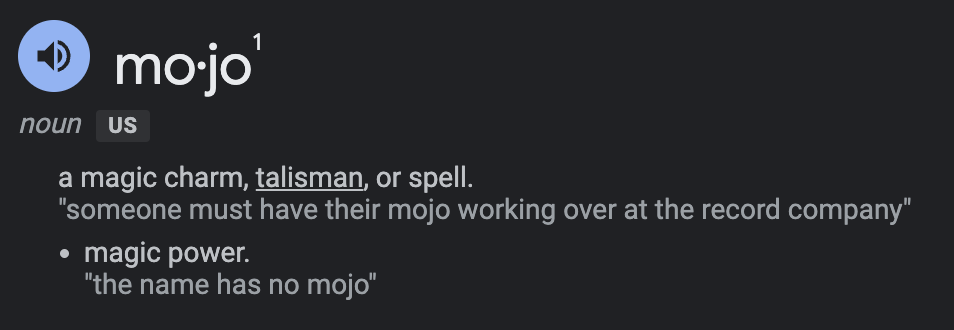
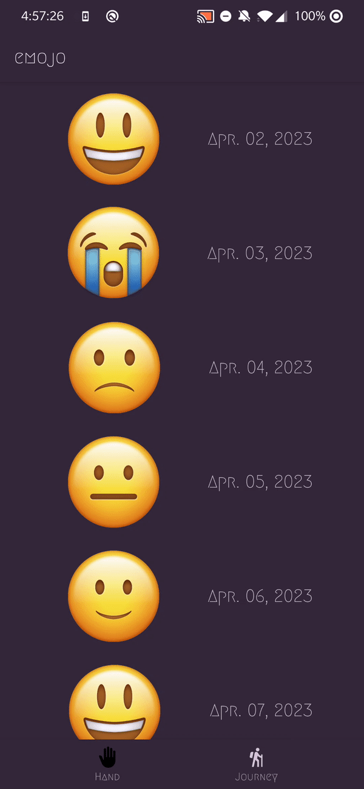

# *emojo*

**emojo** is a magical health metrics and mental wellness app that allows you to track your mood using emojis!

 

  

 

## Completed

- [X] Use at least 2 Fragments
- [X] Use one of the Navigation UI Views (BottomNavigation, Drawer Layout, Top Bar) to move between the fragments
- [X] Swipe to Delete entry from database/recyclerview + w/ animation
- [x] There is a "create entry" UI that prompts users to make their daily entry
- [X] New entries are saved using [SQLite](https://developer.android.com/training/data-storage/sqlite) and then updated in the RecyclerView
- [X] On application restart, previously entered entries are preserved (i.e., are *persistent*)
- [X] Improve and customize the user interface through styling and coloring
- [X] Dynamic UI
- [X] Error Checks
- [X] Calender/Datepicker
- [X] Seek Bar
- [X] Haptic Feeedback

## Ongoing

- [ ] Add journal entry where users can describe why they were feeling that mood
- [ ] Implement daily notifications to prompt users to fill in their data
- [ ] Add more mood spectrums in addition to SAD😭 <-> HAPPY😁  
ANGER😡 <-> PASSION😍  
STRESSED😰 <-> RELAXED😌  
EMBARESSED😳 <-> COOL😎  
SERIOUS😧 <-> AMUSED😂  
SICK🤮 <-> HEALTHY😇  
TIRED😴 <-> LIVELY🥳   

## Video Walkthrough

This showcases dynamic UI and error checks as well as a demo of the recycler view.

Now lets delete the entries!  

GIF created with ...  [EZGif](https://ezgif.com/video-to-gif)
<!-- Recommended tools:
[Kap](https://getkap.co/) for macOS
[ScreenToGif](https://www.screentogif.com/) for Windows
[peek](https://github.com/phw/peek) for Linux. -->

## Notes

Looking to expand app in near future

## License

    Copyright [2023] [Vasanth Banumurthy]

    Licensed under the Apache License, Version 2.0 (the "License");
    you may not use this file except in compliance with the License.
    You may obtain a copy of the License at

        http://www.apache.org/licenses/LICENSE-2.0

    Unless required by applicable law or agreed to in writing, software
    distributed under the License is distributed on an "AS IS" BASIS,
    WITHOUT WARRANTIES OR CONDITIONS OF ANY KIND, either express or implied.
    See the License for the specific language governing permissions and
    limitations under the License.
