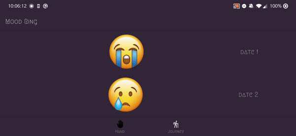

# Android Project 5 - *Mood Ring*

Submitted by: **Vasanth Banumurthy**

**Mood Ring** is a health metrics and mental wellness app that allows you to track your mood using emojis!

Notes: Currently, the app is geared toward tracking happiness. Once the core functionality is ironed out, I plan on adding more mood paradigms. 

SAD😭 <-> HAPPY😁 
ANGER😡 <-> PASSION😍 
STRESSED😰 <-> RELAXED😌
EMBARESSED😳 <-> COOL😎 
SERIOUS😧 <-> AMUSED😂 
SICK🤮 <-> HEALTHY😇
TIRED😴 <-> LIVELY🥳  

Time spent: **4** hours spent in total.

The following **required** functionality is completed:

- [X] **Use at least 2 Fragments**
- [X] **Create a new dashboard fragment where users can see a summary of their entered data**
- [X] **Use one of the Navigation UI Views (BottomNavigation, Drawer Layout, Top Bar) to move between the fragments**

The following **optional** features are implemented:

- [ ] **Add a more advanced UI (e.g: Graphing) for tracking trends in metrics**
- [ ] **Implement daily notifications to prompt users to fill in their data**

The following **additional** features are implemented:
- [X] **Swipe to Delete entry from database/recyclerview + w/ animation
- [X] Fixed issues from last week

## Old Features

The following **required** functionality is completed:

- [X] **At least one health metric is tracked (based on user input)**
  - Chosen metric(s): Mood (Sad -> Happy)
- [x] **There is a "create entry" UI that prompts users to make their daily entry**
- [X] **New entries are saved in a database and then updated in the RecyclerView**
- [X] **On application restart, previously entered entries are preserved (i.e., are *persistent*)**
- [ ] **Create a UI for tracking averages and trends in metrics**
- [X] **Improve and customize the user interface through styling and coloring**
- [X] **Implement orientation responsivity**  
  
Note: Partial implementation. Has issues using fragments.  
- [X] **Add a daily photo feature** 
Note: The emojis are actucally png images. Hence, the user chooses a daily "photo"

Other:

- [X] Dynamic UI
- [X] Error Checks
- [X] Calender/Datepicker
- [X] Seek Bar
- [X] Haptic Feeedback

## Video Walkthrough

Here's a walkthrough

This showcases dynamic UI and error checks as well as a semi-functional demo of the recycler view. Placeholder values are used to showcase how a user might log their daily modd.  
Note: Database implementation incomplete 

GIF created with ...  [EZGif]()
<!-- Recommended tools:
[Kap](https://getkap.co/) for macOS
[ScreenToGif](https://www.screentogif.com/) for Windows
[peek](https://github.com/phw/peek) for Linux. -->

## Notes

Project Notes
I have an idea in my head about how this app can be improved, but I having issues with core functionality such inserting to databases and using that as a source for the RecyclerView. Anything I tried would result in the program becoming unresponsive. Hence, the program is submitted in the most stable state. 

Class Notes
I felt that the lab tutorial was rather disconnected from the project. While it discussed SQLlite and databases, it did so in context to APIs. Moreover, I feel like the past 3 labs have been a lot of copy/paste. These tutorials also made use of stuff we never covered such as Coroutines and Fragments.

## License

    Copyright [2023] [Vasanth Banumurthy]

    Licensed under the Apache License, Version 2.0 (the "License");
    you may not use this file except in compliance with the License.
    You may obtain a copy of the License at

        http://www.apache.org/licenses/LICENSE-2.0

    Unless required by applicable law or agreed to in writing, software
    distributed under the License is distributed on an "AS IS" BASIS,
    WITHOUT WARRANTIES OR CONDITIONS OF ANY KIND, either express or implied.
    See the License for the specific language governing permissions and
    limitations under the License.
